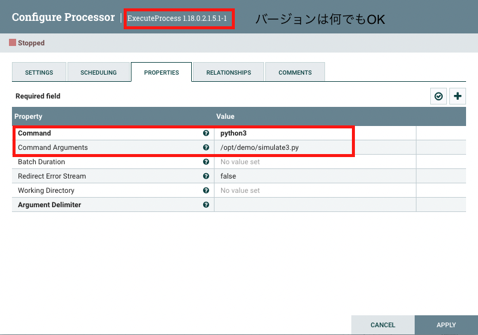
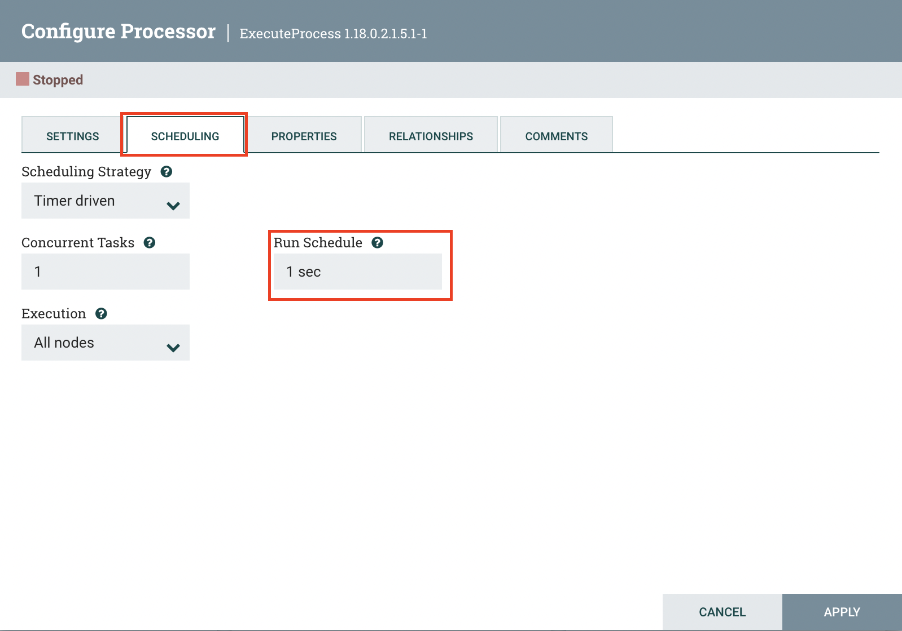

# 事前準備

## 環境作成

- Edge2AI の環境を参加者の人数分立てる

### リモートの参加者がいる場合

リモートの参加者のIPアドレスを聞き、以下のセキュリティグループのInbound Rules（All Traffic）に追加しておく
- xxxx-default-cluster-sg
- xxxx-default-web-sg

## 各環境に対して行う準備

### シミュレーションプログラムの準備

- /opt/demo/simulate.py の内容を、このディレクトリ配下の simulate.py に差し替えておく
- NiFi に ExecuteProcess プロセッサを置き、以下のとおり設定する（実行プログラムは simulate.py で）

## その他、全般的な準備

- 進捗シート的なものがあるとよい
  - 参考：https://docs.google.com/spreadsheets/d/1FHGFV-Kh6orh1VNu-pJEGlJ84tXsDjs6H-vu9MqGkCg/edit?usp=sharing

