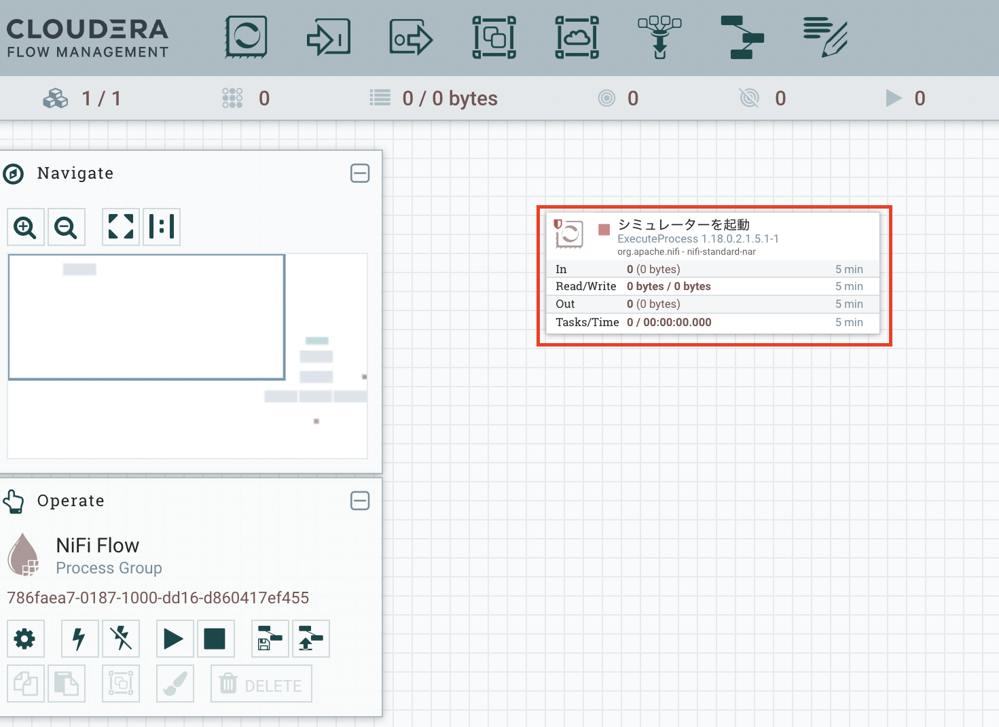

# ステップ０：事前準備

## このステップで行うこと

ハンズオン環境へのログインを行います。

また、アクセス確認も兼ねて、NiFiを動かす練習をします。

## 手順

### ハンズオン環境にログインする

講師よりご案内する、ログインページにアクセスします。

以下の内容を入力し、「Submit」をクリックします。

- Email: ご自身の社用アドレス
- Registration code / Password : 12345678

以下のようなトップページが表示されればOKです。

ハンズオン中は、こちらのトップページからさまざまな機能にアクセスすることができます。

### NiFi を動かす練習

次に、実際のハンズオン環境へのアクセス確認をかねて、NiFiを動かす練習をします。

#### 画面を開く

トップページから「NiFi」をクリックして開きます。

以下のような画面が起動します。

上記の画面のように、「シミュレーターを起動」という箱がひとつだけ表示されていれば想定どおりです。

この箱のことを、NiFiでは「プロセッサー」と呼びます。

ハンズオンでは、まずこのプロセッサーを使って、NiFi のプロセッサーを動かしたり、状態を確認する練習を行います。

練習の方法は、講師より説明します。

以上で、準備とアクセス確認は完了です。

## これから先の演習について

手順を見ながらご自身で進められる方は、ご自身のペースで進めていただいてかまいません。

講師も同様の手順にしたがい、一緒にやりながら演習を進めていきます。

ご不明な点がありましたら、ご遠慮なく手を上げて（リモート参加の方はチャットで）ご質問ください。

次は、[ステップ１：DWHのテーブル作成](lab01_create_DB.md)に進みます。

[>>トップページに戻る<<](00_top.md)