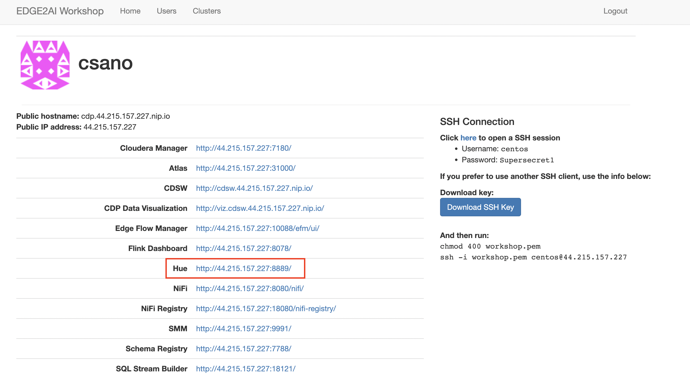
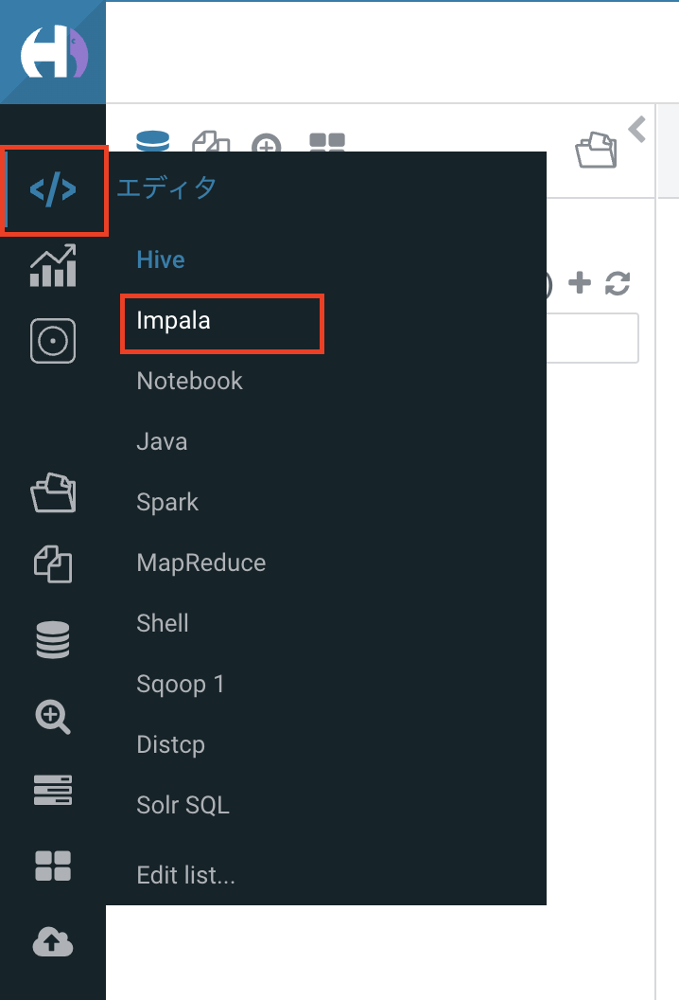
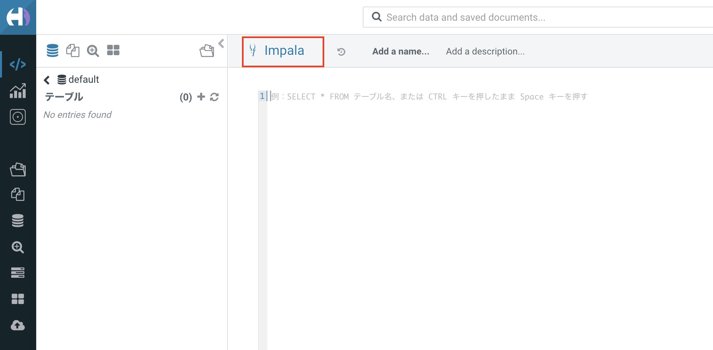
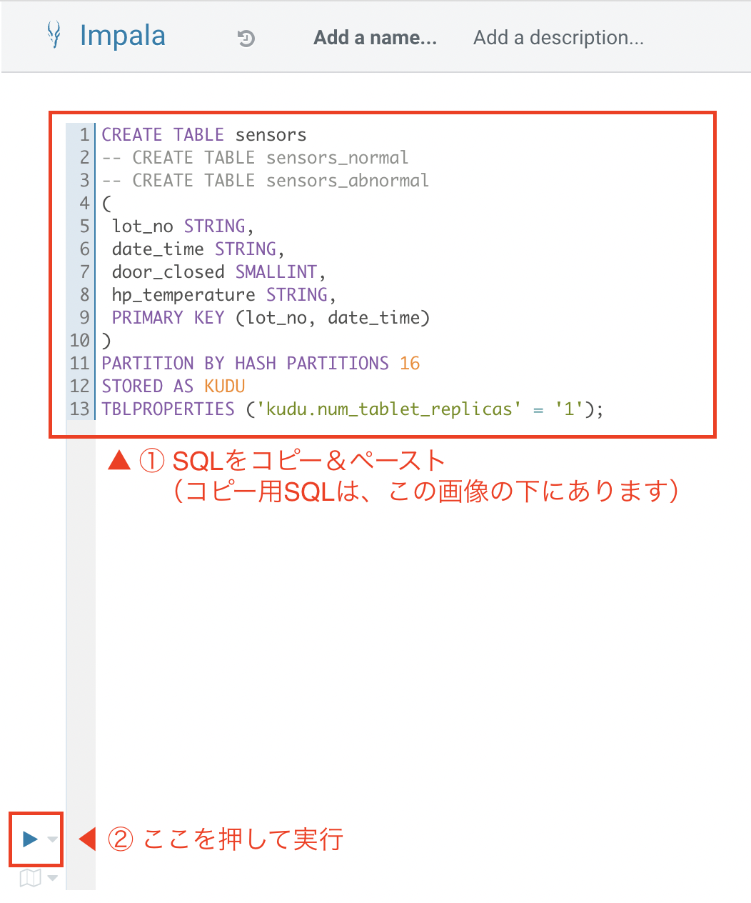
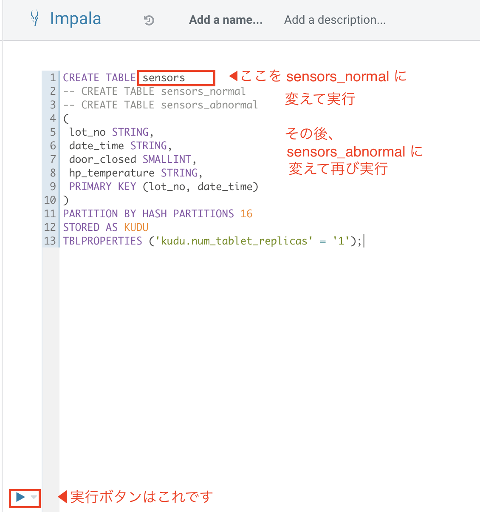

# ステップ１：DWHのテーブル作成

## このステップで行うこと

IoTのデータの最終的な格納先となるDWHのテーブルを作成します。

テーブルは全部で３つ、以下のものを作成します。

- sensors
  - センサーのデータを全件格納するためのテーブル


- sensors_normal
  - センサーのデータのうち、正常データのみを格納するためのテーブル


- sensors_abnormal
  - センサーのデータのうち、異常データのみを格納するためのテーブル


３つのテーブルは、すべて同じ形式（カラム）で作成します。

## 手順

### 画面を開く

トップページから、「Hue」をクリックして開きます。



### impalaを選択

開いた画面の左上の </> マークから「impala」を選択します。



以下の赤枠の箇所が「impala」になっていることを確認します。


### SQLの実行（sensorsテーブルの作成）

以下のSQL を入力し、実行します。



↓コピペ用SQL↓
```commandline
CREATE TABLE sensors
-- CREATE TABLE sensors_normal
-- CREATE TABLE sensors_abnormal
(
 lot_no STRING,
 date_time STRING,
 door_closed SMALLINT,
 hp_temperature STRING,
 PRIMARY KEY (lot_no, date_time)
)
PARTITION BY HASH PARTITIONS 16
STORED AS KUDU
TBLPROPERTIES ('kudu.num_tablet_replicas' = '1');

```

### SQLの実行（sensors_normal, sensors_abnormal テーブルの作成）

SQLの「CREATE TABLE」以下を sensors_normal, sensors_abnormal に変えて、それぞれ実行します。


