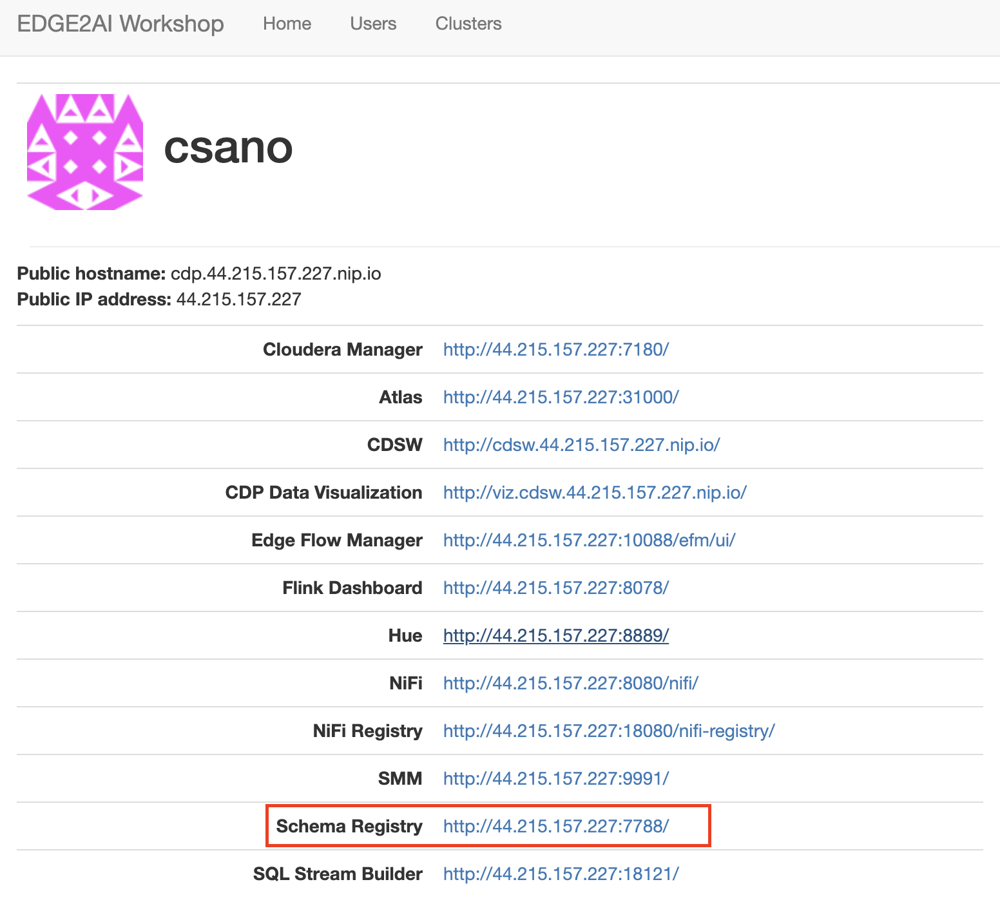
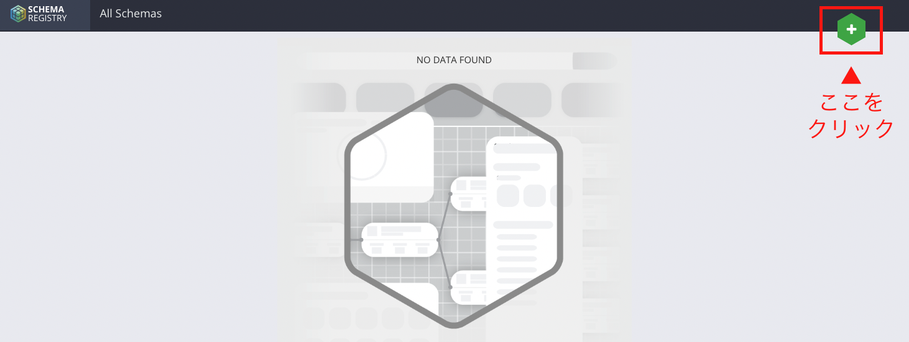

# ステップ２：スキーマレジストリの作成

## このステップで行うこと

データの収集からデータベースへの格納、利用に至るまで、データの構造を一貫して管理できると便利です。

Cloudera プラットフォームの中で、そうした「データ構造の一元管理」を担うのが「スキーマレジストリ」です。

このステップでは、その「スキーマレジストリ」を作成します。

## 手順

### 画面を開く

トップページから、「Schema Registry」をクリックして開きます。



### 新しいスキーマを作成

開いた画面の右上にある「＋」のマークをクリックします。



画面の左側の項目を、以下のとおり設定します。（以下にイメージ画像あり）

- NAME
  - `SensorData` と設定（スペースなし）
  - ここで設定した名称はあとで使うので、正確に設定しましょう
- DESCRIPTION 
  - `sensor data` と設定
  - ここの入力内容は（動かす上では）なんでもいいのですが、入力しないと先へ進めないので一応入力しておきます。実務では、スキーマの内容が簡潔にわかるような内容で設定してください。

他の項目は、デフォルトのままで大丈夫です。


完了したら、画面の右側の空白をダブルクリックします。


すると、テキストの入力欄が表示されます。


テキスト入力欄に、以下のスキーマ定義をコピー＆ペーストします。

```commandline
{
  "type": "record",
  "name": "IotData",
  "namespace": "com.cloudera.example",
  "doc": "This is a sample sensor reading",
  "fields": [
    {
      "name": "lot_no",
      "doc": "Lot identification number.",
      "type": "string"
    },
    {
      "name": "date_time",
      "doc": "Date&time, in microseconds, of the collected readings.",
      "type": "string"
    },
    {
      "name": "is_healthy",
      "doc": "Flag indicating health (healthy == 1)",
      "type": "int"
    },
    {
    "name": "door_closed",
    "doc": "1:closed, 0:open",
    "type": "int"
    },
    {
    "name": "hp_temperature",
    "doc": "Temperature of HP <74: normal >=74: abnormal",
    "type": "float"
    }
  ]
}

```
コピーができたら、「SAVE」をクリックします。


### 完了

以下のように、SensorData という名前のスキーマが作成されていればOKです。


以上で、スキーマレジストリの作成は完了です。
次は、[「ステップ３：NiFiの準備①」](lab03_NiFi1.md)に進みます。

[>>トップページに戻る<<](lab00_top.md)