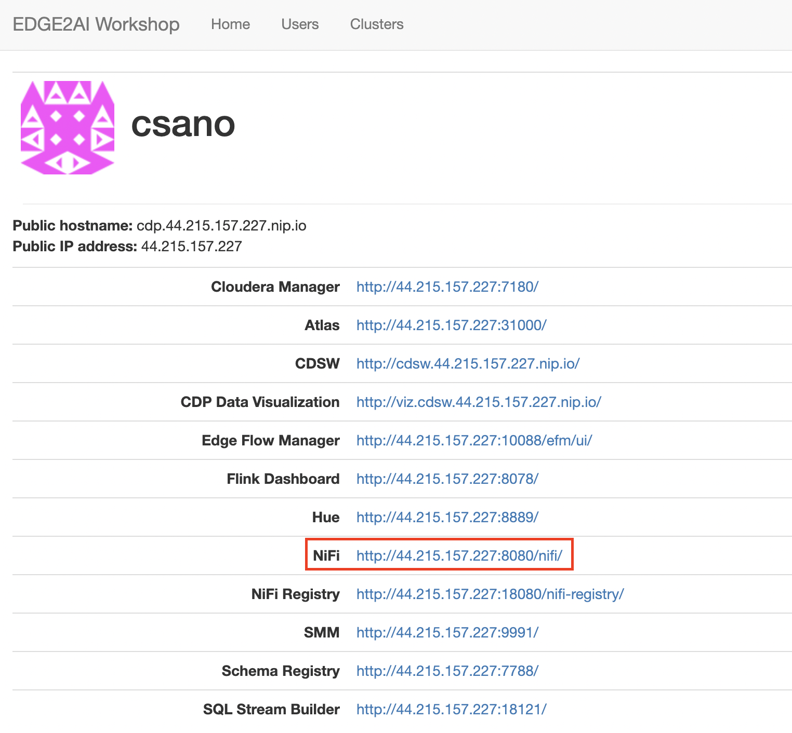

# ステップ３：NiFiの準備

## このステップで行うこと

このハンズオンでは、端末で生成されるデータを「NiFi」を使って収集し、DWHに格納します。

このステップでは、まずはNiFiを使って「端末からデータを収集する」部分の準備を行います。

以下の手順を、順番にやっていきます。

- 手順(1) コントローラーサービスの設定
- 手順(2) 端末からのデータ入力ポートのID取得

## 画面を開く

トップページから、「NiFi」をクリックして開きます。

## 手順(1) - コントローラーサービスの設定

「コントローラーサービス」を利用することで、NiFi のフロー全体にわたって共通的に利用したいスキーマや機能などを設定することができます。

ハンズオンでは、コントローラーサービスを使って、先ほど作成したスキーマレジストリを読み込む仕組みを定義します。

具体的には、以下の３つを設定します。

- スキーマレジストリの定義（HortonworksSchemaRegistry）
- スキーマレジストリを使って、Json形式でデータを読む機能の設定（JsonTreeReader）
- スキーマレジストリを使って、Json形式でデータを書き込む機能の設定（JsonRecordSetWriter）

以下がその手順です。

### プロセスグループの作成

画面上部のアイコンから、「Process Group」（左から４つめ）を選択し、フィールド上の任意の場所にドラッグ＆ドロップします。

以下のようなポップアップが表示されます。 
わかりやすい任意の名前（例：サーバ処理）をつけて「ADD」をクリックします。

### 設定画面を開く

今作成したプロセスグループを右クリックし、出てくるメニューから「Configure」を選択します。

### スキーマレジストリの定義（HortonworksSchemaRegistry）

#### 新規コントローラーサービスの追加

「CONTROLLER SERVICES」タブを選択し、画面右側の「＋」マークをクリックします。

以下の画面で、検索窓に`hort`と入れると、「HortonworksSchemaRegistry」が絞り込み表示されます。 
この状態で、「ADD」をクリックします。

すると、表にHortonworksSchemaRegistryの行が表示されますので、右側の歯車マークをクリックします。

#### プロパティ設定

「PROPERTIES」タブの「Schema Registry URL」の右側をダブルクリックし、出てきた入力欄に以下の内容を設定します。 
（x.x.x.xの部分は、ご自身の演習環境のIPアドレスに変更してください）

設定内容：`http://cdp.x.x.x.x.nip.io:7788/api/v1`

完了したら、「APPLYをクリックします。

#### 有効化

今作成したスキーマレジストリの定義を有効化します。

画面の右側にある稲妻マークをクリックし、出てきた画面で「ENABLE」をクリックします。

しばらく待つと、「Enabling this controller service」の横にチェックマークが表示されます。 
「CLOSE」をクリックします。

以下のように、表の「State」が「Enabled」になっていれば完了です。

以上で、先ほど設定したスキーマレジストリを使う準備ができました。次は、このスキーマレジストリを使ってデータを読み書きするための準備をします。

### JsonTreeReader の設定

#### サービス追加・プロパティ設定

画面右側の「＋」マークをクリックし、出てきた画面の検索窓に「json」と入力します。 
いくつかのサービスが表示される中から、「JsonTreeReader」を選択します。

画面右側の歯車のマークをクリックし、出てきた画面の「PROPERTIES」タブを以下の要領で設定します。

設定内容：　※下記の図のように、入力欄をダブルクリックすると選択肢のリストが出てきます
- Schema Access Strategy
  - Use 'Schema Name' Property
- Schema Registry
  - HortonworksSchemaRegistry

選択できたら、「APPLY」をクリックします。

#### 有効化

いま作成したJsonTreeReaderのサービスを有効化します。 
（手順はHortonworksSchemaRegistryを作成した際の「有効化」の手順を参照）

以下のように、表の「State」が「Enabled」になっていれば完了です。

### Controller Service の確認

下図のポイントを確認したら、×をクリックして NiFi Settings の画面を閉じます。

以上で、コントローラーサービス の設定は完了です。

## 手順(2) 端末からのデータ入力ポートのID取得

このステップの最後に行うのは、「端末からのデータ入力ポートのID取得」です。
端末からのデータ収集にあたり、端末側がデータを送信する際の送信先となるIDを取得します。

### プロセスグループに入る

先ほど作成した「サーバ処理」のプロセスグループを、ダブルクリックして中に入ります。

画面の左下に、以下のようなパンくずリストが表示されていれば中に入れています。

### 入力ポートの追加

NiFiの画面上部より、Input Port のマーク（下図参照）を選択し、フィールドの任意の位置にドラッグ＆ドロップします。

出てくる画面で、以下の項目を設定します。（下図参照）

- Input Port Name
  - 任意の内容を入力します。「端末データ取得」などがわかりやすいでしょう。
- Receive From
  - 選択肢の中から、「Remote connections(site-to-site)」を選択します。

設定できたら「ADD」をクリックします。

以下のように、入力ポートのアイコンがフィールド上に表示されればOKです。

※ 名前や設定内容を変更したい場合は、上記のアイコンをダブルクリックすることで変更できます。

### IDの取得

今追加した入力ポートのアイコンをダブルクリックし、詳細設定のポップアップを起動します。 
出てきた画面の「Id」をコピーし、メモ帳などに貼り付けておきます。

終わったら、「CANCEL」または「APPLY」をクリックして画面を閉じます。

以上で、NiFiの準備は完了です。
次は、[「ステップ４：端末からのデータ送信の仕組みを作る」](lab04_create_EdgeFlowManagement.md)に進みます。

[>>トップページに戻る<<](00_top.md)