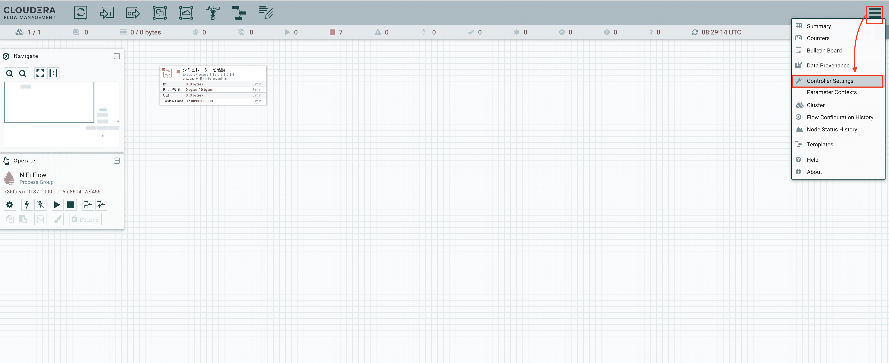

# ステップ３：NiFiの準備①

## このステップで行うこと

このハンズオンでは、端末で生成されるデータを「NiFi」を使って収集し、DWHに格納します。

このステップでは、まずはNiFiを使って「端末からデータを収集する」部分の準備を行います。

## 手順(1) - 準備

### 画面を開く

トップページから、「NiFi」をクリックして開きます。

### NiFi を動かす練習

以下のような画面が起動します。

上記の画面のように、「シミュレーターを起動」という箱がひとつだけ表示されていれば想定どおりです。

この箱のことを、NiFiでは「プロセッサー」と呼びます。

ハンズオンでは、まずこのプロセッサーを使って、NiFi のプロセッサーを動かしたり、状態を確認する練習を行います。

練習の方法は、講師より説明します。

（演習が早く終わってしまった方は、練習を飛ばして次の手順に進んでも大丈夫です）

## 手順(2) - コントローラーサービスの設定

「コントローラーサービス」を利用することで、NiFi のフロー全体にわたって共通的に利用したいスキーマや機能などを設定することができます。

ハンズオンでは、コントローラーサービスを使って、先ほど作成したスキーマレジストリを読み込む仕組みを定義します。

具体的には、以下の３つを設定します。

- スキーマレジストリの定義（HortonworksSchemaRegistry）
- スキーマレジストリを使って、Json形式でデータを読む機能の設定（JsonTreeReader）
- スキーマレジストリを使って、Json形式でデータを書き込む機能の設定（JsonRecordSetWriter）

以下がその手順です。

### 設定画面を開く

画面右上の三本線のマークをクリックし、配下の「Controller Settings」を選択します。

### スキーマレジストリの定義（HortonworksSchemaRegistry）

#### 新規コントローラーサービスの追加

「MANAGEMENT CONTROLLER SERVICES」タブを選択し、画面右側の「＋」マークをクリックします。

以下の画面で、検索窓に`hort`と入れると、「HortonworksSchemaRegistry」が絞り込み表示されます。 
この状態で、「ADD」をクリックします。

すると、表にHortonworksSchemaRegistryの行が表示されますので、右側の歯車マークをクリックします。

#### プロパティ設定

「PROPERTIES」タブの「Schema Registry URL」の右側をダブルクリックし、出てきた入力欄に以下の内容を設定します。 
（x.x.x.xの部分は、ご自身の演習環境のIPアドレスに変更してください）

設定内容：`http://cdp.x.x.x.x.nip.io:7788/api/v1`

完了したら、「APPLYをクリックします。

#### 有効化

今作成したスキーマレジストリの定義を有効化します。

画面の右側にある稲妻マークをクリックし、出てきた画面で「ENABLE」をクリックします。

しばらく待つと、「Enabling this controller service」の横にチェックマークが表示されます。 
「CLOSE」をクリックします。

以下のように、表の「State」が「Enabled」になっていれば完了です。

以上で、先ほど設定したスキーマレジストリを使う準備ができました。次は、このスキーマレジストリを使ってデータを読み書きするための準備をします。

### JsonTreeReader の設定

#### サービス追加・プロパティ設定

画面右側の「＋」マークをクリックし、出てきた画面の検索窓に「json」と入力します。 
いくつかのサービスが表示される中から、「JsonTreeReader」を選択します。

画面右側の歯車のマークをクリックし、出てきた画面の「PROPERTIES」タブを以下の要領で設定します。

設定内容：　※下記の図のように、入力欄をダブルクリックすると選択肢のリストが出てきます
- Schema Access Strategy
  - Use 'Schema Name' Property
- Schema Registry
  - HortonworksSchemaRegistry

選択できたら、「APPLY」をクリックします。

#### 有効化

いま作成したJsonTreeReaderのサービスを有効化します。 
（手順はHortonworksSchemaRegistryを作成した際の「有効化」の手順を参照）

以下のように、表の「State」が「Enabled」になっていれば完了です。

### JsonRecordSetWriter の設定

以上で、xxは完了です。
次は、[ステップx：xx](lab03_NiFi1.md)に進みます。