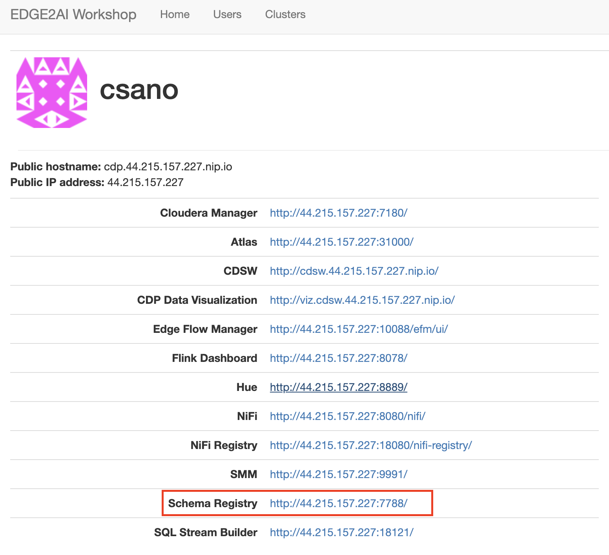

# ステップ４：端末からのデータ送信の仕組みを作る

## このステップで行うこと

今までの手順では、中央のサーバーで管理対象の端末データを受信する準備をしてきました。

今度は、管理対象の端末側に配布するプログラムを作っていきます。

## 手順

### 画面を開く

トップページから、「」をクリックして開きます。

画面左側の田の字のようなマークをクリックします。「iot-1」というクラスがすでにできているので、選択し、「OPEN」をクリックします。

### MQTTを取得する

端末で発生するデータを、MQTT形式で取得するプロセッサを作成します。

画面左側の「PROCESSOR」アイコンを、方眼紙状のフィールドの任意の場所にドラッグ＆ドロップします。

プロセッサの種類を選択する画面が表示されますので、「ConsumeMQTT」を選択し「ADD」をクリックします。

以上で、xxは完了です。
次は、[「ステップ５：NiFiの準備②」](lab05_NiFi2.md)に進みます。

[>>トップページに戻る<<](lab00_top.md)