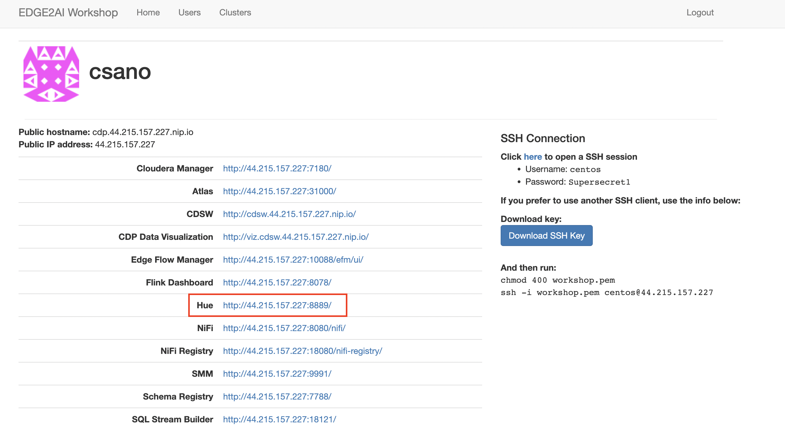
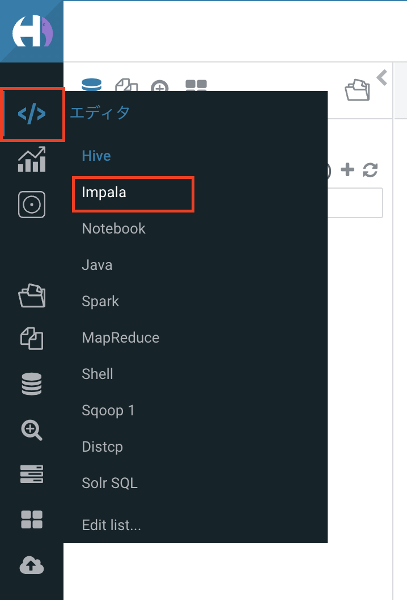
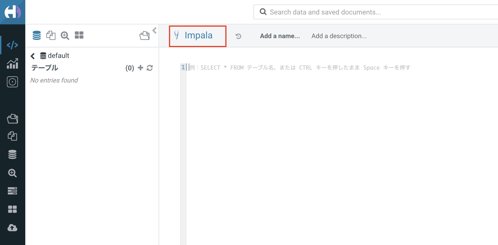

# ステップ７：データのクエリ

## このステップで行うこと

ステップ６までの手順で、DWHにデータを格納することができました。 
最後のステップとして、DWHに入ったデータをSQLで確認します。

## 手順

### 画面を開く

トップページから、「Hue」をクリックして開きます。

### impalaを選択

開いた画面の左上の </> マークから「impala」を選択します。

以下の赤枠の箇所が「impala」になっていることを確認します。

### DB のクエリ

クエリに以下のSQLを入力し、実行してみましょう。
`select * from sensors order by date_time desc, lot_no asc`

以下のように、クエリの結果が表示されていればOKです。

以上で、演習は完了です。おつかれさまでした！

### おまけの演習(早く終わった方向け)

今回の演習では、ランダムな頻度で異常な温度（74°以上）のデータが生成されるようになっています。

クエリを `select * from sensors where cast(hp_temperature as float) >= 74` に変えて、異常値のデータだけを抽出してみましょう。

※ 異常データの生成頻度はランダムなので、実行時間が短いとゼロ件になる可能性があります。ゼロ件になった場合は、NiFiをもう一度長めに実行し、停止してから、クエリを実行してみてください。

その他、SQLを色々と変えて、データを抽出してみましょう。

[>>トップページに戻る<<](00_top.md)