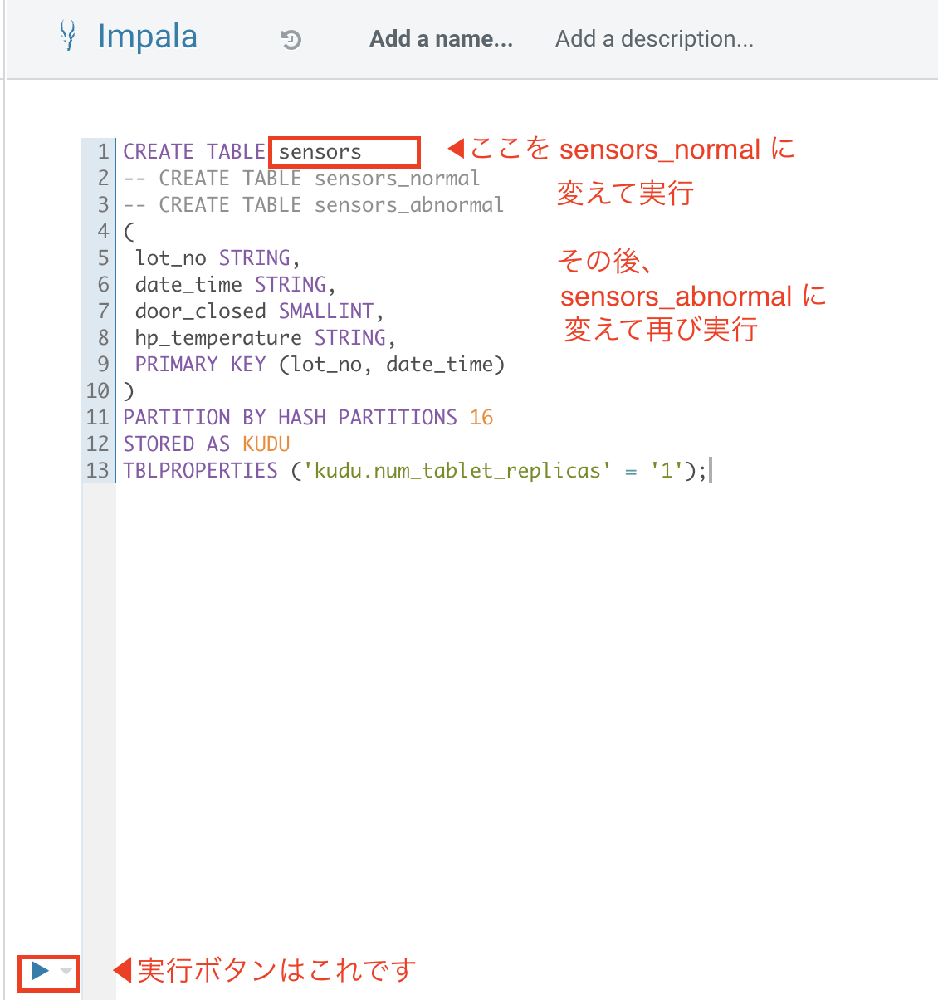
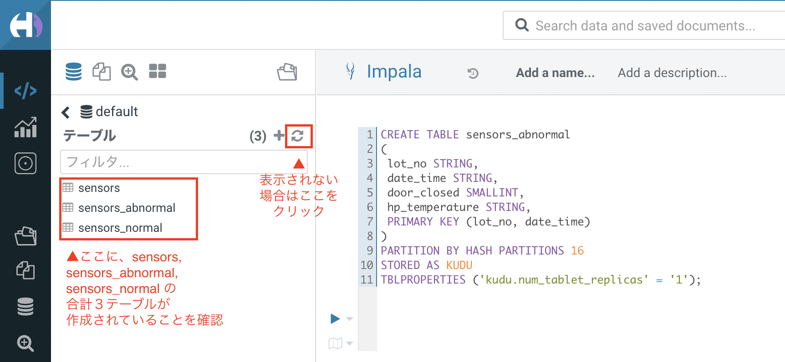

# ステップ８（応用）：データの振り分け

## このステップで行うこと

ここから先は、ステップ７までが早く終わった方向けの応用編です。<br>

現在、`sensors` テーブルには、端末のデータが全件入ってきます。

応用編では、正常データのみを格納するテーブル`sensors_normal`と、異常データのみを格納するテーブル`sensors_abnormal`を作成し、温度によってデータの格納先を振り分けます。

## 手順

以下の手順で行います。

(1) テーブルの作成（正常のみ／異常のみデータ格納用）<br>
(2) DB格納処理の追加<br>
(3) コントローラーサービスの追加<br>
(4) 振り分け処理の追加<br>
(5) NiFiの実行・確認

### (1) テーブルの作成（正常のみ／異常のみデータ格納用）

基本編で作成した`sensors`と同じ構造で、以下のテーブルを作成します。

- sensors_normal
  - センサーのデータのうち、正常データのみを格納するためのテーブル

- sensors_abnormal
  - センサーのデータのうち、異常データのみを格納するためのテーブル

#### 実施内容

[手順１](lab01_create_DB.md)と同じ要領で、 SQLの「CREATE TABLE」以下を sensors_normal, sensors_abnormal に変えて、それぞれ実行します。



実行し終わったら、以下を確認します。



以上で、テーブルの作成は完了です。

### (2) DB格納処理の追加

手順(1)で作成したテーブルに、データを追加するプロセッサーを追加します。

#### 実施内容

##### プロセッサのコピー

NiFi の画面を開き、「サーバー処理」のプロセッサーグループの中に入ります。

以下の図を参考に、「データベースに書き込み」のプロセッサをふたつコピーします。

##### 表示名の変更

プロセッサーをダブルクリックし、「Name」欄を編集することで表示の名称を変更することができます。<br>


コピー元、コピー先 それぞれのプロセッサーを、わかりやすい名前に変更しましょう。<br>
以下のように、一見してわかる名前をつけて区別をしておくと便利です。


##### 格納先テーブルの変更

「データベースに書き込み（正常）」をダブルクリックします。<br>
「PROPERTIES」タブの「Table Name」を、`default.sensors_normal`に変更します。


同じ要領で、「データベースに書き込み（異常）」の Table Name を、`default.sensors_abnormal`に変更します。


以上で、手順(1)で作成したテーブルにデータを書き込む準備ができました。

### (3) コントローラーサービスの追加

これから追加する振り分け処理の下準備として、NiFi のコントローラーサービスに JsonRocordSetWriterを追加します。<br>
これは、振り分け処理を行う際に、振り分けたデータをスキーマに従って書き込みできるようにするためのものです。

#### 実施内容

##### 設定画面を開く

[ステップ３の手順(1)「設定画面を開く」](https://github.com/sanochihi/iot_workshop/blob/main/01_docs/lab03_NiFi1.md#%E8%A8%AD%E5%AE%9A%E7%94%BB%E9%9D%A2%E3%82%92%E9%96%8B%E3%81%8F)を参考に、NiFi のコントローラーサービスの設定画面を開きます。

##### サービス追加・プロパティ設定

画面右側の「＋」マークをクリックし、出てきた画面の検索窓に「json」と入力します。<br>
いくつかのサービスが表示される中から、「JsonTreeReader」を選択します。


画面右側の歯車のマークをクリックし、出てきた画面の「PROPERTIES」タブを以下の要領で設定します。

設定内容：　※前の手順と同様、入力欄をダブルクリックすると選択肢のリストが出てきます
- Schema Write Strategy
  - HWX Schema Reference Attributes
- Schema Access Strategy
  - Use 'Schema Name' Property
- Schema Registry
  - HortonworksSchemaRegistry


選択できたら、「APPLY」をクリックします。

##### 有効化

いま作成したJsonRecordSetWriterのサービスを有効化します。<br>
（手順はHortonworksSchemaRegistryを作成した際の「有効化」の手順を参照）

以下のように、表の「State」が「Enabled」になっていれば完了です。


### (4) 振り分け処理の追加

ここから、いよいよ振り分け処理の作成に入っていきます。

#### QueryRecord プロセッサーの追加

「スキーマ名を設定」の横あたりに、プロセッサーをドラッグ＆ドロップします。


以下のポップアップでは、「QueryRecord」を選択し「ADD」をクリックします。<br>
(`queryr`と入力すると、絞り込み表示されます)


#### リレーションの接続変更

「スキーマ名を変更」から「データベースに書き込み（全件）」に接続されていたリレーションを、以下の動画を参考に「QueryRecord」につなぎ変えます。


#### QueryRecordプロセッサの詳細設定

##### 名称変更

QueryRecord プロセッサをダブルクリックし、「SETTINGS」タブから名称を変更します。<br>
わかりやすい名前ならなんでもOKです。ここでは「データ振り分け」としておきます。


##### プロパティ設定 

「PROPERTIES」タブで、以下の項目を選択します。

- Record Reader -> JsonTreeReader を選択
- Record Writer -> JsonRecordSetWriter を選択
- Include Zero Record FlowFiles -> false を選択


#### 振り分け条件の設定 - 正常

ここから、正常データを振り分けるための条件を設定していきます。

PROPERTIESタブの右側の「＋」マークをクリックし、Property Name に `normal` と設定し「OK」をクリックします。


すると、以下の入力欄が表示されます。<br>
ここには、`normal`として判定するべき条件をSQLで定義します。

図の下にあるSQL文をコピーし、「OK」をクリックします。


```SQL
SELECT * FROM FLOWFILE WHERE
hp_temperature <= 74
```

これで、hp_temperature に入った温度の値が74度以下のデータを正常として振り分ける処理が作成できました。

#### 振り分け条件の設定 - 異常

同じ要領で、`abnormal`というプロパティを追加し、以下のSQLを設定します。

```SQL
SELECT * FROM FLOWFILE WHERE
hp_temperature > 74
```

これで、hp_temperature に入った温度の値が74度を超えるデータを異常として振り分ける処理が作成できました。

#### リレーションシップの終了条件の設定

「RELATIONSHIPS」タブで、「failure」の下の「terminate」にチェックを入れ、「APPLY」をクリックします。


#### リレーションシップの設定

「データの振り分け」から、「データベースに書き込み（全件）」に向かってリレーションシップをつなぎます。


以下の画面が表示されるので、「original」にチェックを入れ、「ADD」をクリックします。


これは、データの振り分け処理を行う前の状態（オリジナルデータ＝全件）を、「データベースに書き込み（全件）」に送るという意味です。

同じ要領で、以下のリレーションを接続します。

- 正常データの振り分け
  - 「データ振り分け」→「データベースに書き込み（正常）」にリレーションを接続
  - 「normal」にチェックを入れ「ADD」
  
- 異常データの振り分け
  - 「データ振り分け」→「データベースに書き込み（異常）」にリレーションを接続
  - 「abnormal」にチェックを入れ「ADD」

最終的に、以下のようになっていればOKです。


### (5) NiFiの実行・確認

これまでの手順で、作成が完了しました。<br>
いよいよNiFiを動かし、その結果をDBでみてみましょう。

#### NiFiの実行

NiFi Flow のトップに戻り、処理を実行してみましょう。

実行方法、エラーの確認、処理を止める方法は、[ステップ６](lab06_Nifi3.md)を参考にしてください。

エラーが出た場合は処理を止め、講師を呼んで原因を解決してください。

#### 処理状況の確認（NiFi）

実行中、または実行完了後に「サーバ処理」のプロセスグループの中に入り、以下のポイントを確認します。


異常データはランダムに生成されるため、実行時間が短いとゼロ件になる可能性があります。

異常データが１件以上作成されるまで処理を動かしたら、処理を止めましょう。

#### 処理結果の確認（Hue）

[ステップ７](lab07_query_DB.md)の手順を参考に、select 文の対象テーブルを今作成した `sensors_normal` や `sensors_abnormal` に変更し、SQLを実行してみましょう。

- 正常テーブル抽出用SQL
  - `select * from sensors_normal order by date_time desc, lot_no asc`
- 異常テーブル抽出用SQL
  - `select * from sensors_abnormal order by date_time desc, lot_no asc`

正常テーブルの実行結果


異常テーブルの実行結果


このような振り分けをリアルタイムに行っていくことで、温度異常と関連性の高い項目を抽出するなど、機械学習の活用につなげやすくなります。

## おつかれさまでした✨

以上で、応用編も完了です。おつかれさまでした！

さらに詳しく知りたいことがありましたら、ご遠慮なく講師にご質問ください。

[>>トップページに戻る<<](00_top.md)